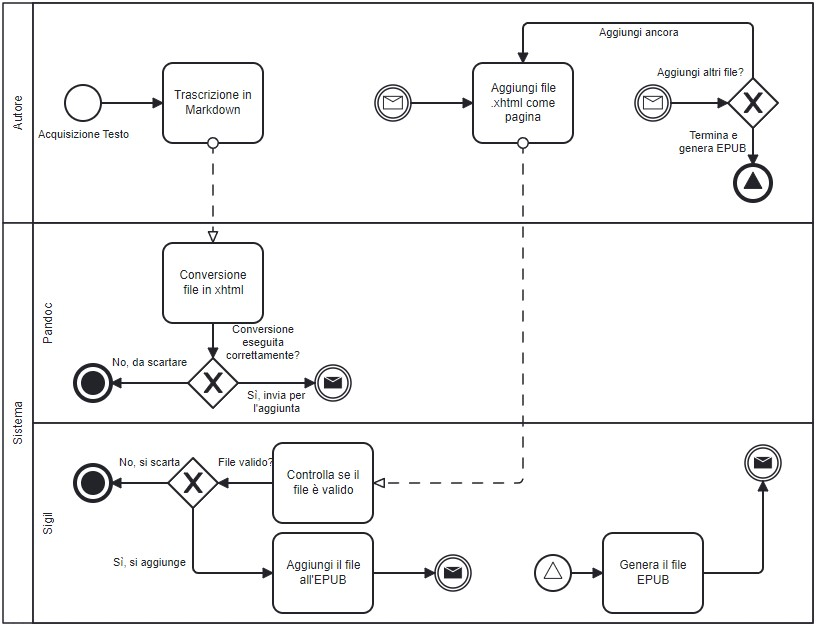

# Menù Antica Pizzeria Santi

## Introduzione

Il progetto è stato pensato con lo scopo di riprodurre il Menù di un ristorante-pizzeria in un formato moderno e accessibile sui dispositivi mobili, anche per diminuire il bisogno di menù cartacei.

La pizzeria in questione è l'**Antica Pizzeria Santi** di Rivolta d'Adda.

Si vuole creare un `EPUB`, quindi un book digitale (e-book) sfogliabile dai dispositivi mobili e quindi consultabile sul proprio telefono in modo semplice.

Il progetto sarà utile alla pizzeria perché espandibile, facilmente modificabile, accessibile dai propri telefoni e permetterà di vedere un anteprima delle pizze e dei piatti.

## Ideazione 

### Tema
Il tema tratta il menù di una pizzeria *reale*, quindi pizze, piatti e bevande verranno suddivise in macro categorie ed ogni tipo di piatto/prodotto avrà una pagina a lei dedicata con varie informazioni al riguardo, come gli ingredienti, allergeni, presenza di alcool, grami, centilitri etc...
Si vuole digitalizzare il menù per *diminuire la presenza di menù cartacei* e promuovere quello digitale, anche perché *altamente configurabile* in qualsiasi momento. 

### Destinatari
I destinatari sono tutti i *clienti* della pizzeria in questione, i target quindi possono essere persone di tutte le età senza discriminazioni, purché si possegga un dispositivo mobile con cui visualizzare il menù.

### Requisiti di accettazione
I destinatari devono essere invogliati a fare il meno possibile per visualizzare l'epub. Però per visualizzarlo servirebbe un apposita applicazione, perciò l'unica cosa che si richiede è l'integrazione di una estensione sul proprio browser come "**EPUB Viewer**" che permette la visualizzazione del menù. Dopodiché il prodotto deve essere ben strutturato affinché il cliente possa navigare senza problemi nell'epub e possa visualizzare il menù senza intoppi, per questo è presente un indice iniziale con le *macro-aeree* (pizze, cucina e bevande) e ogni singolo piatto, così leggendo il nome si può andare direttamente alla pagina interessata, è anche necessario che ogni pagina tratti di un solo prodotto così da mantenerne l'ordine.

### Canali di distribuzione
Il menù sarà distribuito tramite **link** e **QR code** via *WEB*.
Siccome è il menù di un ristorante principalmente viene condiviso in sede, tramite un QR code sui tavoli.
Però deve anche essere possibile la sua visualizzazione da casa e per questo si possono utilizzare link che portano all'EPUB condividendolo tramite social come Facebook, Instagram etc...

## Processo di Produzione

### Acquisizione dei contenuti
Tutte le informazioni sulle pizze, piatti di cucina e le bevande sono state reperite dal menù reale della Pizzeria in questione, quindi è stato fatto un lavoro di trascrizione manuale di ogni pagina per piatto.

### Gestione documentale

### Tecnologie adottate

Le tecnologie adottate per la realizzazione del Menù digitale sono:

1. *Markdown*: linguaggio utilizzato per la trascrizione delle informazioni di ogni piatto, scelto per la sua semplicità sintattica.
2. *XHTML*: linguaggio utilizzato come formato di ogni pagina dell'EPUB, scelto per la sua rigidità e per evitare errori durante la produzione dell'epub.
3. *CSS*: linguaggio utilizzato per lo style di ogni pagina dell'EPUB.
4. *Python*: linguaggio utilizzato per lo script di conversione da Markdown a XHTML, scelto per la sua portabilità e leggerezza.
5. *Pandoc*: tecnologia utilizzata per la conversione dinamica da un tipo di file ad un altro, scelto per la sua dinamicità e supportabilità di tanti tipi di formato.
6. *Sigil*: editor gratuito per i file EPUB, scelto principalmente perché gratuito, ma anche perché genera la struttura di un EPUB automaticamente e non permette di caricare file in cartelle sbagliate, così da rendere il contenuto omogeneo.

### Esecuzione del flusso
Tutto il materiale utilizzato è disponibile in una repository su GitHub.
[Clicca qui](https://github.com/antonioubilluzaguilar/ProgettoEditoria_Settembre_2024).

## Valutazione dei risultati raggiunti

### Valutazione del flusso di produzione

Durante il processo di produzione, l'utilizzo di `Markdown` ha reso semplice e abbastanza rapida la trascrizione di ogni pizza, piatto e bevanda. `Pandoc` è stato essenziale per una conversione corretta e rapida di ogni file in `xhtml` che essendo più rigoroso avrebbe moltiplicato in modo esponenziali i tempi di trascrizione.
In fine l'utilizzo dell'editor gratuito `Sigil` ha reso semplice la gestione della struttura dell'`EPUB` autogenerando e autoaggiornando il content.opf ad ogni modifica di quest'ultima, imponendo anche limitazioni ma che si sono rivelati importanti per mantenere l'`EPUB` integro, in più tramite un apposita funzione è possibile aggiungere i metadati come autori, luogo, lingua etc... all'`EPUB`.

### Limiti emersi

Il processo di conversione potrebbe essere un problema su larga scala in caso di generazione di un EPUB da 0, però è stato alleggerito con l'utilizzo di uno script in `Python` che eseguiva i comandi `pandoc` semplicemente inserendo il nome del file in `Markdown`.

## Conclusioni

L'`EPUB` ottenuto è da considerarsi soddisfacente siccome rispetta le aspettative e i requisiti impostati all'inizio. Il prodotto in sè è facilmente modificabile e facilmente accessibile quindi per la pizzeria sarà un ottimo sostituto al Menù cartaceo, tutta via ci sono altre vie per digitalizzare un menù, come un menù in formato `pdf` che essendo un formato supportato da ogni dispostivo poteva raggiungere facilmente molti più destinatari con meno requisiti. Ci si aspetta che in un futuro l'`EPUB` venga ampliato e che venga considerata anche l'idea di generarne un `pdf` tramite `LaTeX` così da fornire entrambe le opzioni.

## Bibliografia e sitografia

### Bibliografia
[@AnticaPizzeriaSanti]

### Sitografia
1. [Python](https://www.python.org/downloads/)
2. [Pandoc](https://pandoc.org/installing.html)
3. [Sigil](https://sigil-ebook.com/sigil/download/)